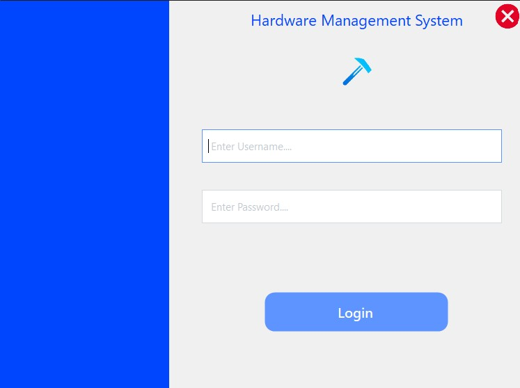
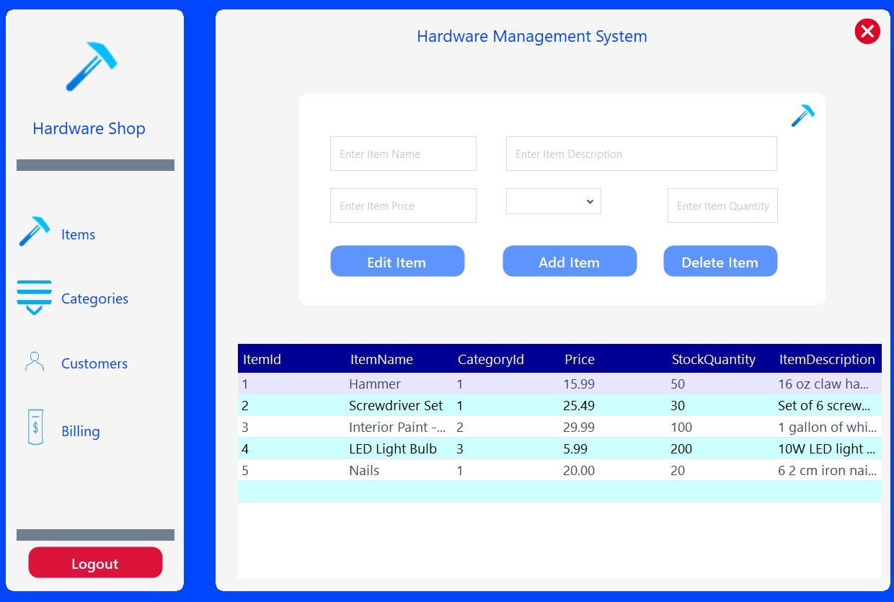
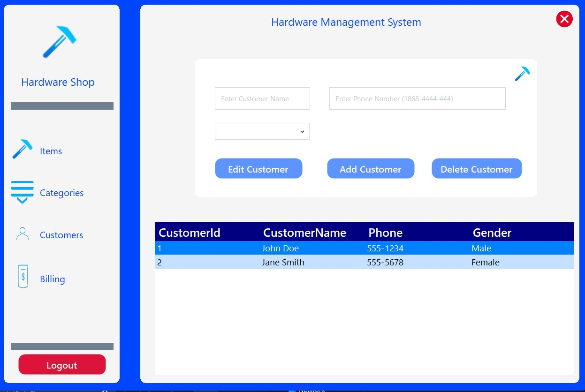
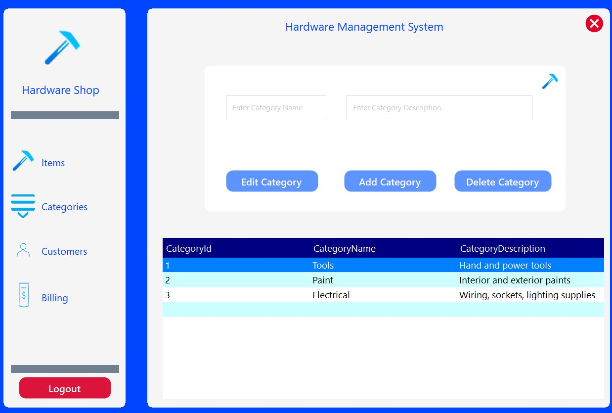
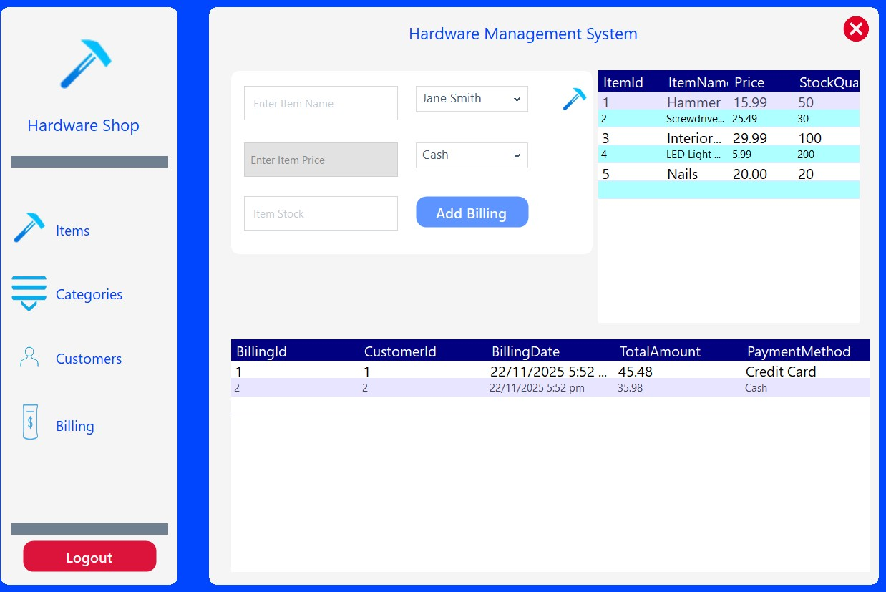

# 🚀 Hardware Management System


A modern C# WinForms inventory & billing management application with full CRUD support, SQL Server integration, Guna UI2 styling, Dockerized database environment, and smooth UI transitions.

## 📌 Project Overview

The Hardware Management System is a desktop application built using C# (.NET Windows Forms) and styled with Guna.UI2, offering a clean, modern interface for managing:

- 🧾 **Items** - Inventory management
- 👥 **Customers** - Customer database
- 🗂 **Categories** - Item categorization
- 💵 **Billings** - Sales and billing
- 🔐 **User Login & Auth** - Secure authentication
- 🗄 **SQL Server Database** - Data persistence

The project includes Docker support, allowing automatic SQL Server setup and database initialization using `init-database.sql`.

## 🛠 Tech Stack

| Technology | Description |
|---|---|
| **C# .NET Framework** | Core Windows Forms application |
| **SQL Server** | Database backend |
| **Docker / Docker Compose** | Containerized SQL Server |
| **Guna.UI2** | Modern UI components |
| **Windows Forms** | Application architecture |

## ✨ Key Features

### 🔐 Authentication
- Login screen with fade-in transition
- Admin validation
- Keyboard support (Enter to login)

### 📦 Items Management
- Add, edit, delete, and view items
- Integrated SQL operations
- Clean Guna UI2 inputs & tables

### 👥 Customer Management
- Full CRUD customer table


### 🗂 Categories Module
- Manage item categories
- Database-backed storage

### 💵 Billing Module
- Generate bills
- Track customer purchases
- Pull from Items + Customers tables

### 🗄 Database Layer
- Centralized `Functions.cs` helper class
- Parameterized queries (prevents SQL injection)
- `.env` file for secure DB credentials

### 🐳 Docker Support
- `docker-compose.yml` runs SQL Server automatically
- Seeds initial data from `init-database.sql`
- `entrypoint.sh` sets up database on container start

### 🎨 Modern UI/UX
- Smooth transitions
- Modern control styling
- Splash screen
- Consistent form navigation

## 🖼 Screenshots

| 🔑 Login Screen | 📦 Items Management | 👥 Customers |
|-----------------|------------------|-------------|
|  |  |  |

| 🗂 Categories | 💵 Billing |
|---------------|------------|
|  |  |

----

## 🐳 Running With Docker

### 1️⃣ Build & Start SQL Server Container
```bash
docker-compose up --build -d
```

### 2️⃣ SQL Server Initialization
The container automatically initializes via:
- `entrypoint.sh`
- `init-database.sql`

### 3️⃣ Run the WinForms Application
Launch the application locally via Visual Studio

## 🔧 Environment Variables

Create a `.env` file in the project root (ignored by Git):

### `.env` File 1 (Application Folder)
```
DB_SERVER=DB_SERVER_NAME,PORT # localhost,1433 for example
DB_NAME= YOUR_DB_NAME
DB_USER=YOUR_DB_USERNAME
DB_PASSWORD=YOUR_DB_PASSWORD
```
##### inside the folder with project files(where the window forms and other program files ) and # SQL Server 

### `.env` File 2 (Root Folder - Docker)
```
SA_PASSWORD=YOUR_STRONG_SA_PASSWORD
ACCEPT_EULA=Y
DB_PORT=YOUR_DB_PORT # 1433 for example
CONTAINER_NAME= YOUR_CONTAINER_NAME
DB_NAME= YOUR_DB_NAME
```
##### At the root of the project where the sln and the other Docker files are -->🚀 Hardware Management System

## 🧩 Database Init Script (`init-database.sql`)

Automatically creates the following tables:
- `Items` - Product inventory
- `Customers` - Customer information
- `Categories` - Product categories
- `Billings` - Sales transactions

The script also seeds base data for initial setup.

## 🧠 Extra Notes

- The application uses fade-in transitions for smoother UX
- Login form supports Enter key to submit
- All forms share consistent theme using Guna UI2
- Parameterized SQL queries prevent injection attacks
- All database credentials are managed via `.env` files

## 📜 License

This project is under the **MIT License**.
See `LICENSE.txt` for details.
